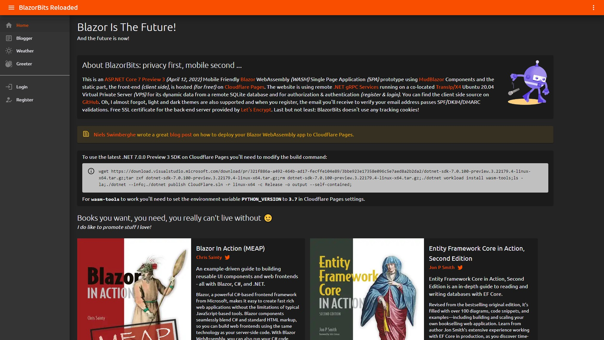

# Static Blazor WASM Website on CloudFlare Pages

**Live Site: https://blazorbits.openwiki.com/**

[Niels Swimberghe](https://twitter.com/RealSwimburger) wrote a great [blog post](https://swimburger.net/blog/dotnet/how-to-deploy-blazor-webassembly-to-cloudflare-pages) on how to deploy your Blazor WebAssembly Static Website to [CloudFlare Pages](https://pages.cloudflare.com/).

To use the latest .NET 7.0.0 Preview 3 SDK (April 13, 2022) on Cloudflare Pages you'll need to modify the build command: 👇

`wget https://download.visualstudio.microsoft.com/download/pr/321f886a-a492-464b-ad17-fecffe104e89/3bbe923e17358e096c5e7aed8a2b2da2/dotnet-sdk-7.0.100-preview.3.22179.4-linux-x64.tar.gz;tar zxf dotnet-sdk-7.0.100-preview.3.22179.4-linux-x64.tar.gz;rm dotnet-sdk-7.0.100-preview.3.22179.4-linux-x64.tar.gz;./dotnet workload install wasm-tools;ls -la;./dotnet --info;./dotnet publish CloudFlare.sln -r linux-x64 -c Release -o output --self-contained;`

For **wasm-tools** to work you'll need to set the environment variable **PYTHON_VERSION** to **3.7** in Cloudflare Pages settings.

This live prototype receives its data from remote .NET 7 Preview gRPC services running on a co-located Ubuntu VPS.

Everything .NET! 😉

---

