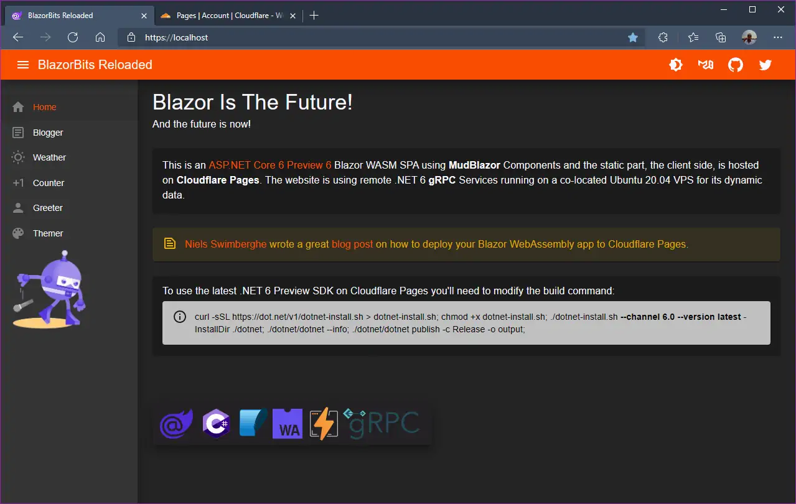

**Static Blazor WASM Website on CloudFlare Pages**

Link: https://blazorbits.openwiki.com/

[Niels Swimberghe](https://twitter.com/RealSwimburger) wrote a great [blog post](https://swimburger.net/blog/dotnet/how-to-deploy-blazor-webassembly-to-cloudflare-pages) on how to deploy your Blazor WebAssembly Static Website to [CloudFlare Pages](https://pages.cloudflare.com/).

To use the latest .NET 6 Preview you'll need to modify the build command 👇

`curl -sSL https://dot.net/v1/dotnet-install.sh > dotnet-install.sh; chmod +x dotnet-install.sh; ./dotnet-install.sh --channel 6.0 --version latest -InstallDir ./dotnet; ./dotnet/dotnet --info; ./dotnet/dotnet publish -c Release -o output;`

This demo receives its data from a remote .NET 6 gRPC service running on a co-located Ubuntu VPS with Kestrel(!) as webserver.

Everything .NET! 😉

