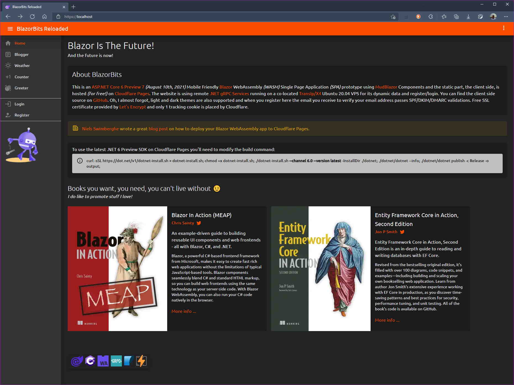

**Static Blazor WASM Website on CloudFlare Pages**

Live Site: https://blazorbits.openwiki.com/

[Niels Swimberghe](https://twitter.com/RealSwimburger) wrote a great [blog post](https://swimburger.net/blog/dotnet/how-to-deploy-blazor-webassembly-to-cloudflare-pages) on how to deploy your Blazor WebAssembly Static Website to [CloudFlare Pages](https://pages.cloudflare.com/).

To use the latest .NET 6 RC2 SDK on Cloudflare Pages you'll need to modify the build command: 👇

`wget https://download.visualstudio.microsoft.com/download/pr/20283373-1d83-4879-8278-0afb7fd4035e/56f204f174743b29a656499ad0fc93c3/dotnet-sdk-6.0.100-rc.2.21505.57-linux-x64.tar.gz;tar zxf dotnet-sdk-6.0.100-rc.2.21505.57-linux-x64.tar.gz;./dotnet workload install wasm-tools;./dotnet --info;./dotnet publish -c Release -o output --self-contained;`

For **wasm-tools** to work you'll need to set the environment variable **PYTHON_VERSION** to **3.7** in Cloudflare Pages settings.

This live prototype receives its data from remote .NET 6 gRPC services running on a co-located Ubuntu VPS.

Everything .NET! 😉

